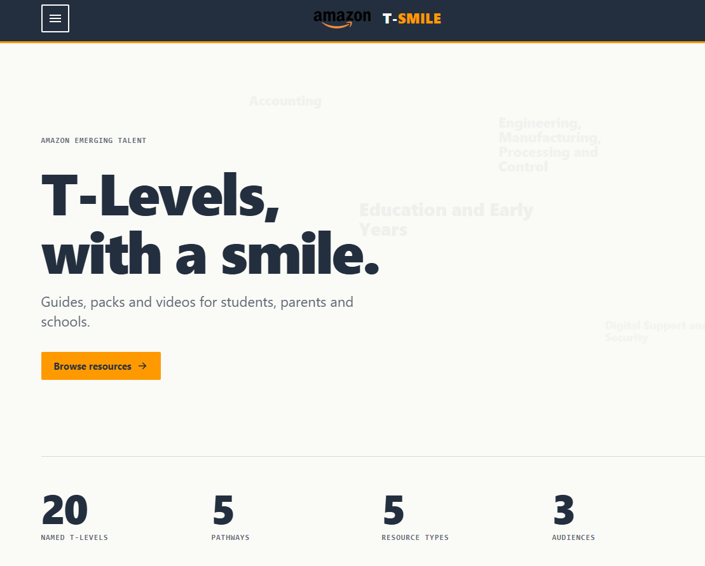
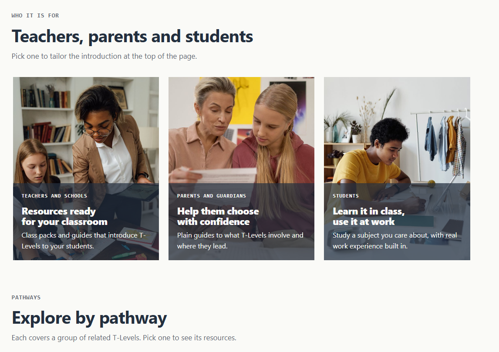
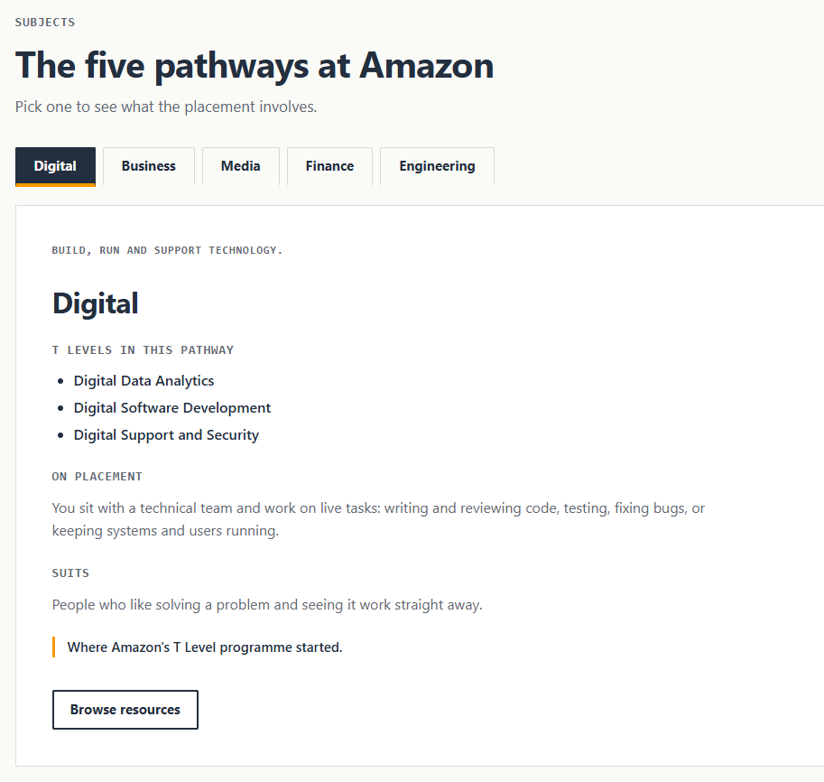
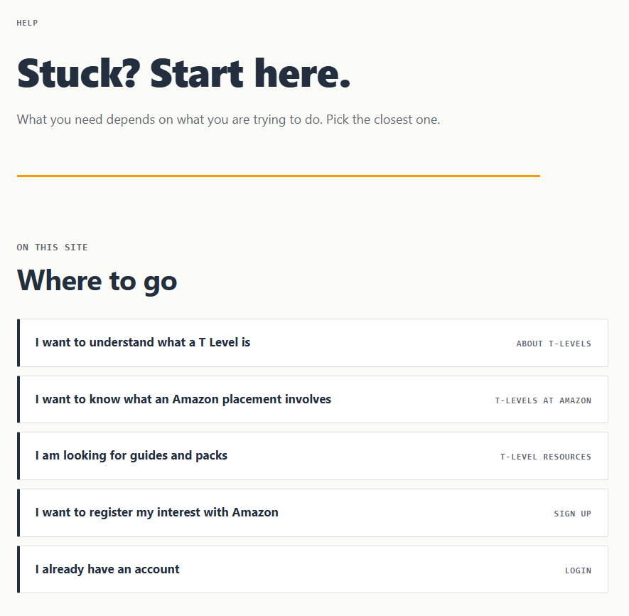
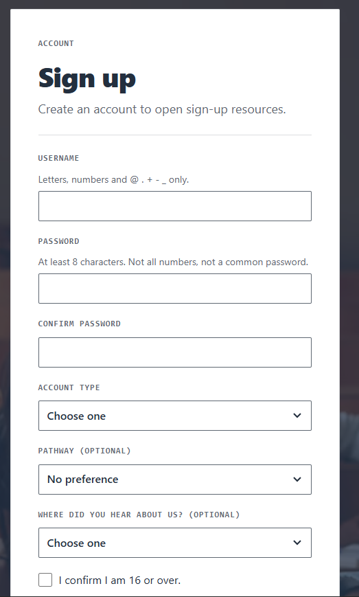

# T-SMILE

**Amazon Emerging Talent Digital T Level project** - information and advice about T Levels, free and gated digital content, and a way to register interest in Amazon's T Level opportunities, all in one place.

[](https://github.com/3yther/Amazon-Website/actions/workflows/ci.yml)


**Live preview:** https://frontend-production-2990.up.railway.app/ (temporary Railway preview)

> Read [`CONTEXT.md`](CONTEXT.md) (stack, design rules, conventions) and [`MODELS.md`](MODELS.md) (the locked database schema) before changing anything.

**Stack:** Python 3.11 + Django REST Framework, React + Vite, SQLite locally / PostgreSQL in production, AWS (EC2 + RDS + S3) with a Railway preview.

## Contents

- [About](#about)
- [Features](#features)
- [Screenshots](#screenshots)
- [Project layout](#project-layout)
- [Getting started](#getting-started)
- [Running tests](#running-tests)
- [Deployment](#deployment)
- [API reference](#api-reference)
- [Admin](#admin)
- [How we work](#how-we-work)
- [Troubleshooting](#troubleshooting)
- [Design principles](#design-principles)
- [Team](#team)
- [Notes](#notes)
- [Licence](#licence)

## About

T-SMILE is a Django REST API (`backend/`) with a React (Vite) front end (`frontend/`), built for four audiences: students (16-18), parents and guardians, schools and teachers, and Amazon staff, who manage content and review submissions.

The site does three jobs:

- Explains T Levels in general, and at Amazon, by pathway (Digital, Business, Media, Finance, Engineering).
- Hosts a content library of guides, documents, videos and prep packs - some free, some gated behind sign-up.
- Captures Expressions of Interest from students, parents and teachers.

## Features

- **T Level information** by pathway (Digital, Business, Media, Finance, Engineering), in general and at Amazon.
- **Content library** of guides, documents, videos and prep packs, some free and some gated behind a sign-up.
- **Accounts** with sign up and log in, so gated content unlocks for signed-in users.
- **Expression of Interest** form, validated server side and rate limited.
- **Find Near You** page to find T Level courses and placements nearby.
- **AI assistant** that answers T Level questions. It needs an `ANTHROPIC_API_KEY` on the backend; without one the widget shows a fallback message and the rest of the site still works.
- **Help, About and T Level at Amazon** information pages.
- **Staff admin** where Amazon staff review submissions and manage content.

## Screenshots

**Homepage**





**Explore by pathway**



**Help page**



**Sign up**



<!-- Add these when you have them:


-->

## Project layout

```
backend/
  config/      settings, root URLs
  accounts/    Profile (extends Django's built-in User)
  content/     Pathway, ContentItem, content API
  interest/    ExpressionOfInterest, submission API
  chatbot/     ChatMessage, AI assistant API (/api/chat/)
frontend/
  src/api.js                    all calls to the Django API
  src/pages/ContentLibrary.jsx  example page: lists content from the API
  src/styles.css                colour tokens and styles
```

## Getting started

Needs **Python 3.11** and **Node 20.19+** (or 22.12+).

### Backend

In one terminal:

```bash
cd backend
python3.11 -m venv venv
source venv/bin/activate
pip install -r requirements.txt
cp .env.example .env
python -c "from django.core.management.utils import get_random_secret_key as k; print(k())"
# paste the printed key into .env as DJANGO_SECRET_KEY
python manage.py migrate
python manage.py loaddata pathways   # optional: the five pathways
python manage.py createsuperuser
python manage.py runserver
```

### Frontend

In a second terminal:

```bash
cd frontend
npm install
npm run dev
```

### Open it

Visit **http://localhost:5173**. The Vite dev server forwards `/api` and `/media` to Django on port 8000. Add content at **http://localhost:8000/admin/**.

### Configuration

Both `backend/` and `frontend/` ship an `.env.example` file. Copy each one and fill it in. Never commit a real `.env` file.

**Backend** (`cp backend/.env.example backend/.env`):

| Variable | Needed | Purpose |
| --- | --- | --- |
| `DJANGO_SECRET_KEY` | Always | Signs sessions and CSRF tokens. Generate one with the command in the backend setup above. |
| `DJANGO_DEBUG` | Local only | `True` for local development, `False` (or unset) in production. |
| `DJANGO_ALLOWED_HOSTS` | Always | Comma-separated hostnames Django will serve. Defaults to `localhost,127.0.0.1`. |
| `CORS_ALLOWED_ORIGINS` | If cross-origin | Only when the React app is served from a different origin than the API. The Vite proxy makes them the same origin locally, so you can leave the default. |
| `CSRF_TRUSTED_ORIGINS` | If cross-origin | Same as above, for CSRF. |
| `ANTHROPIC_API_KEY` | For the assistant | Key from console.anthropic.com. Without it the chat widget shows its fallback message. Never commit it. |
| `DATABASE_URL` | Deployed only | A `postgres://` URL. When set, it replaces SQLite. Leave unset locally. |
| `DJANGO_BEHIND_HTTPS_PROXY` | Deployed only | `true` when a proxy in front ends HTTPS (Railway does). |

Production also has commented-out `POSTGRES_*` and `AWS_*` variables for RDS and S3. See the comments in `backend/config/settings.py`.

**Frontend** (`cp frontend/.env.example frontend/.env.local`, only if you need it):

| Variable | Needed | Purpose |
| --- | --- | --- |
| `VITE_API_BASE_URL` | Rarely | Leave empty for local dev and the Railway preview, where a proxy sends `/api` to Django. Only set it to the API's full origin if the front end is ever hosted on a different site from the API. |

For preview and production variables, see [`DEPLOYMENT.md`](DEPLOYMENT.md).

## Running tests

```bash
cd backend && python manage.py test
```

## Deployment

A preview build runs on [Railway](https://railway.com) so the team and mentor can use the site at a public URL - see [`DEPLOYMENT.md`](DEPLOYMENT.md) for the full setup and environment variables. The final deployment target is AWS (EC2 + RDS + S3).

The Railway preview is temporary and has known limits: the Django admin is unstyled, and uploaded content files are not kept between deploys. These are expected, not bugs. Full list in [`DEPLOYMENT.md`](DEPLOYMENT.md).

## API reference

| Method | URL | Notes |
| --- | --- | --- |
| GET | `/api/pathways/` | All pathways (not paginated) |
| GET | `/api/pathways/<slug>/` | One pathway |
| GET | `/api/content/` | Paginated. Filters: `pathway=<slug>`, `audience=student|parent|teacher`, `access_level=free|signup` |
| GET | `/api/content/<slug>/` | One item |
| POST | `/api/interest/` | Expression of Interest. Validated server side, rate limited |

Filtering by pathway also returns items for all pathways; filtering by audience also returns items for everyone. Sign-up content is listed for everyone, but its `file` link is only sent to signed-in users (`locked: true` otherwise).

## Admin

Amazon staff review Expressions of Interest at `/admin/`. Submissions are read-only there. A staff account needs "Staff status" plus the "Can view expression of interest" permission (or be a superuser).

## How we work

- Branch and pull request workflow on GitHub. No direct commits to `main`.
- Branch names use a `feat/` prefix, for example `feat/auth`, `feat/resources`, `feat/eoi`.
- Never commit secrets, `.env` files or `*.pem` keys. Check `.gitignore` first.

## Troubleshooting

- **Wrong Python or Node version.** The backend needs Python 3.11 and the frontend needs Node 20.19+ (or 22.12+). Check with `python3.11 --version` and `node --version`.
- **The Resources filter is empty.** The five pathways are not loaded. Run `python manage.py loaddata pathways` in the backend.
- **`/api` requests fail in the browser.** Make sure Django is running on port 8000 in a second terminal. The Vite dev server on 5173 forwards `/api` and `/media` to it.
- **Django will not start.** Usually a missing `DJANGO_SECRET_KEY`. Generate one and paste it into `.env` (see [Getting started](#getting-started)).

## Design principles

- Amazon Orange `#FF9900` and Amazon Dark Blue `#232F3E` on warm off-white `#FAFAF7`. No purple, no gradients.
- Squared buttons, no pill shapes. SVG line icons, no emoji.
- Minimal, punchy copy. No filler, no fake reviews or metrics.
- WCAG 2.2 AA, and `prefers-reduced-motion` respected for any animation.

Full rules in [`CONTEXT.md`](CONTEXT.md).

## Team

Built by five T Level students:

- **Amir** - framework for the entire website
- **Aaron** - AI chatbot
- **Micha** - About, Help and T-Level at Amazon pages
- **Jakub** - sign up and log in pages
- **Lloyd** - Find Near You page

## Notes

- The pathway summaries in `backend/content/fixtures/pathways.json` are draft copy. Check them against gov.uk before launch.
- Production swaps SQLite for PostgreSQL on RDS and local files for S3. See the comments in `backend/config/settings.py`.
- Never commit `.env` files or `*.pem` keys.

## Licence

This is a student project built for the Amazon Emerging Talent Digital T Level programme, published for viewing and assessment only. All rights reserved. See [`LICENSE`](LICENSE) for details. "Amazon" and related marks belong to Amazon.com, Inc. or its affiliates; this is not an official Amazon product.
